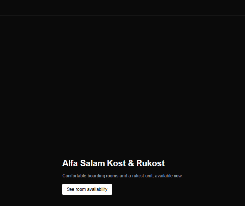

# Alfa Salam Kost & Rukost — Site



**Work in progress.** Public-facing site for a boarding-house (kost) and
rental-house (rukost) business — `/rooms` and `/rukost` are live against a
Supabase backend; `/about` and `/contact` are still placeholder copy.

See [PROGRESS.md](PROGRESS.md) for current status and next steps.

## Getting started

```bash
npm install
npm run dev
```

Requires a `.env.local` with `NEXT_PUBLIC_SUPABASE_URL` and
`NEXT_PUBLIC_SUPABASE_ANON_KEY` for the shared Supabase project (see
[src/lib/supabase.ts](src/lib/supabase.ts)).

## Stack

- Next.js 16, React 19, Tailwind CSS
- Supabase (anon-key client only, no auth)
